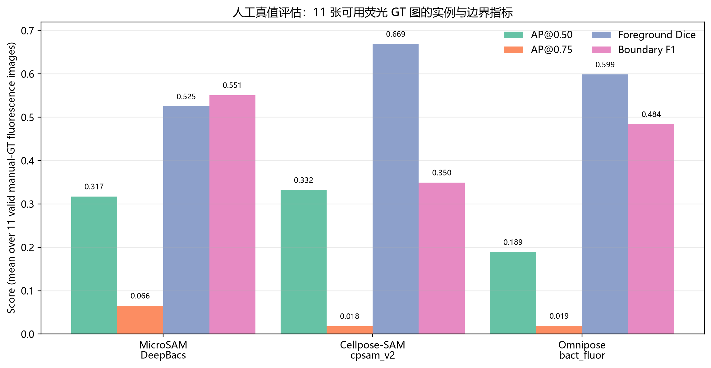
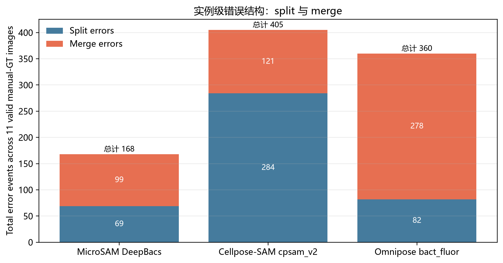
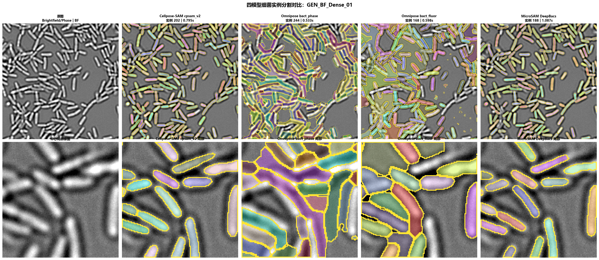
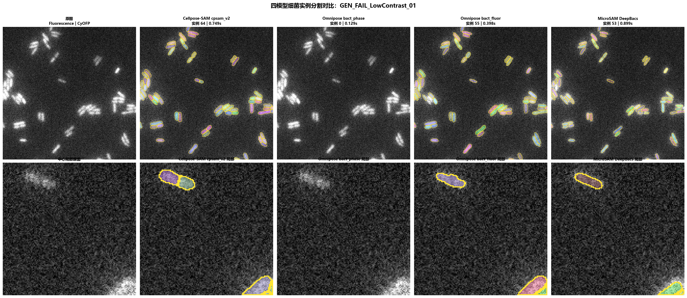
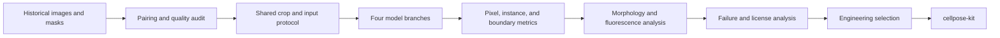

[**English**](README.md) | [简体中文](README.zh-CN.md)

# Bacterial Microscopy Segmentation Benchmark

> A practical model study for bacterial microscopy instance segmentation, from data auditing and quantitative comparison to engineering selection.

This repository documents a comparison of Cellpose-SAM, MicroSAM DeepBacs, Omnipose, and a conventional image-processing workflow on laboratory bacterial microscopy images. The study first audited image–mask relationships, then evaluated all model outputs under one coordinate system and one metric implementation. Its engineering conclusion led to the deployable [`cellpose-kit`](https://github.com/desperati0n/cellpose-kit).

## Highlights

- Audited **2,902 reliable source-image/reference-mask pairs**: 1,691 brightfield/phase-contrast and 1,211 fluorescence pairs. Another 576 processed files were excluded because no reliable source match could be established.
- Reviewed 15 manual or candidate annotations; only **11 reliable fluorescence GT masks** were used for quantitative accuracy evaluation.
- Generated **8,706 instance-label outputs** across four model branches: Cellpose-SAM 2,902, MicroSAM 2,902, Omnipose phase 1,691, and Omnipose fluorescence 1,211.
- Compared AP@0.50, AP@0.75, IoU, Dice, Boundary F1, count error, split/merge events, and matched-instance morphology/fluorescence error.
- Published **45 four-model comparison panels** covering manual-GT samples, ordinary brightfield/fluorescence images, dense scenes, and low-contrast failures.

## Key results

The table below uses the 11 fluorescence GT images that passed quality review. The sample size is limited, so these results support engineering decisions and failure analysis rather than a universal leaderboard.

| Model | AP@0.50 ↑ | AP@0.75 ↑ | Foreground Dice ↑ | Boundary F1 ↑ | Median relative count error ↓ | Splits ↓ | Merges ↓ |
|---|---:|---:|---:|---:|---:|---:|---:|
| Cellpose-SAM `cpsam_v2` | **0.3322** | 0.0183 | **0.6693** | 0.3496 | **0.0460** | 284 | 121 |
| MicroSAM DeepBacs | 0.3174 | **0.0655** | 0.5251 | **0.5512** | 0.1519 | **69** | **99** |
| Omnipose `bact_fluor` | 0.1892 | 0.0188 | 0.5989 | 0.4842 | 0.3663 | 82 | 278 |





## What the comparison showed

- **Cellpose-SAM** was the strongest coverage/counting baseline in this batch, but its high split count limits single-cell measurement fidelity.
- **MicroSAM DeepBacs** produced better strict overlap, boundaries, and matched-instance morphology/fluorescence measurements, at the cost of lower visual completeness in some crowded images.
- **Omnipose** provides modality-specific bacterial models, but `bact_fluor` showed a substantial merge risk in the current fluorescence batch.
- Reliable brightfield human GT was unavailable, so brightfield results are used only for workflow agreement and failure discovery—not a true accuracy ranking.

## Gallery

The complete gallery is in [`figures/gallery/`](figures/gallery/). Each 2×5 panel shows the source image, four full-image overlays, and their center crops.





## Research workflow



## Repository contents

```text
.
├── README.md / README.zh-CN.md
├── report/                         Full technical report in both languages
├── figures/
│   ├── metrics/                    Aggregate evaluation figures
│   └── gallery/                    45 four-model comparison panels
└── results/                        Aggregate and detailed CSV outputs
```

- [Full technical report](report/technical-report.md)
- [完整中文报告](report/technical-report.zh-CN.md)
- [Gallery notes](figures/gallery/README.md)

## Publication scope

The repository includes the report, metric figures, result tables, and the complete comparison gallery. It does not distribute approximately 31.8 GB of source images, 9.3 GB of display-enhanced images, 8.6 GB of batch intermediates, model weights, or virtual environments.

Historical masks measure workflow agreement and cannot replace human ground truth. Model choice should ultimately follow task-specific metrics on an independent held-out GT set.

## From research to deployment

Considering coverage, counting behavior, cross-modality utility, deployment complexity, and licensing, the study selected Cellpose-SAM as its first engineering baseline. [`cellpose-kit`](https://github.com/desperati0n/cellpose-kit) exposes it as a Dockerized FastAPI GPU service and an Agent Skill that returns instance labels, a QA overlay, per-instance measurements, and traceable runtime metadata.

## Licensing note

No model weights are included. Third-party code, models, and weights retain their respective licenses. See [Section 7 of the technical report](report/technical-report.md#7-licensing-and-commercial-use) for the version-specific engineering review. Confirm ownership and publication permission for repository-authored reports, figures, and gallery images before choosing a repository-wide license.
