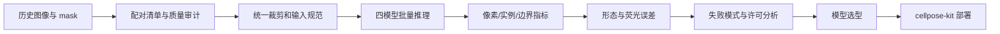

# Bacterial Microscopy Segmentation Benchmark

> A reproducible study of instance-segmentation models for bacterial microscopy images, covering data auditing, quantitative evaluation, failure analysis, model selection, and deployment handoff.

本仓库记录一次面向实验室细菌显微图像的实例分割调研。项目没有从“哪张彩色叠加图更好看”出发，而是先审计原图与掩膜，再统一比较 Cellpose-SAM、MicroSAM DeepBacs、Omnipose 和传统图像处理结果，最后把模型结论转化为可部署工具。

工程化成果见 [`cellpose-kit`](https://github.com/desperati0n/cellpose-kit)：一个基于 Docker、FastAPI 和 GPU 推理的 Cellpose-SAM 服务及 Agent Skill。

## TL;DR

- 从实验室历史目录中整理出 **2,902 对**可靠的原图–既有处理 mask，其中明场/相差 1,691 对、荧光 1,211 对；另有 576 个处理文件因无法可靠配对而排除。
- 对 15 张人工/候选掩膜逐张审计，只将其中 **11 张可靠荧光 GT** 纳入准确率计算。
- 完成四个模型分支共 **8,706 份实例标签**：Cellpose-SAM 2,902、MicroSAM 2,902、Omnipose phase 1,691、Omnipose fluor 1,211。
- 公开 **45 张四模型对比画廊**，覆盖人工 GT、普通明场/荧光以及密集、低对比等失败场景。
- 统一评估 AP@0.50、AP@0.75、IoU、Dice、Boundary F1、计数误差、split/merge，以及匹配实例的形态与荧光测量误差。
- 结论不是“一个模型全面胜出”：Cellpose-SAM 更适合作为覆盖与计数基线，MicroSAM DeepBacs 的边界和单菌测量更稳，Omnipose 的主要风险因成像模态而异。

## 核心结果

以下结果来自 11 张通过质量审计的荧光人工 GT。样本量有限，因此用于技术选型和失败模式分析，不应被解释为通用模型排行榜。

| 模型 | AP@0.50 ↑ | AP@0.75 ↑ | 前景 Dice ↑ | Boundary F1 ↑ | 中位相对计数误差 ↓ | split ↓ | merge ↓ |
|---|---:|---:|---:|---:|---:|---:|---:|
| Cellpose-SAM `cpsam_v2` | **0.3322** | 0.0183 | **0.6693** | 0.3496 | **0.0460** | 284 | 121 |
| MicroSAM DeepBacs | 0.3174 | **0.0655** | 0.5251 | **0.5512** | 0.1519 | **69** | **99** |
| Omnipose `bact_fluor` | 0.1892 | 0.0188 | 0.5989 | 0.4842 | 0.3663 | 82 | 278 |


## 画廊预览

完整画廊位于 [`figures/gallery/`](figures/gallery/)，包含人工 GT、普通样本和专门构造的失败场景。


## 研究流程



完整过程见：

- [技术调研与实测报告](report/technical-report.md)
- [项目历程](docs/project-journey.md)
- [评估方法与口径](docs/methodology.md)
- [发布前检查清单](docs/publication-checklist.md)

## 仓库结构

```text
.
├── README.md
├── docs/                       项目历程、方法与发布检查
├── report/technical-report.md  完整调研报告（公开整理版）
├── figures/
│   ├── metrics/                汇总图表
│   └── gallery/                完整四模型对比画廊（45 张 PNG + 说明）
├── results/                    聚合后的 CSV 结果
├── src/                        独立的实例分割指标实现
└── tests/                      指标单元测试
```

## 可复现范围

本仓库公开评估逻辑、聚合及详细指标结果、报告图表和完整四模型对比画廊。为了让仓库保持适合 GitHub 浏览和克隆，不分发约 31.8 GB 原图、9.3 GB 可视化增强图、8.6 GB 全量处理中间结果、模型权重或虚拟环境。

浏览完整画廊：[figures/gallery/](figures/gallery/)。每张图采用 2×5 面板，依次展示原图、四个模型的全景叠加，以及相应的中心局部放大。

安装并运行指标测试：

```bash
python -m pip install -e ".[test]"
pytest
```

模型权重不应提交到 Git。请通过各项目的官方渠道获取，并记录模型名称、版本、来源、许可证与文件校验哈希。

## 如何阅读这些结果

- AP 和 Dice 反映检出与覆盖，但不能单独说明相邻细菌是否正确分开。
- Boundary F1 与 AP@0.75 对边界偏移更敏感。
- 总数接近不代表实例对应正确，必须同时查看 split 和 merge。
- 传统 mask 只用于流程一致性参考，不能代替人工真值。
- 当前没有可靠明场人工 GT，因此不对明场模型给出真实准确率排名。

## 从调研到部署

综合当前数据上的覆盖和计数表现、跨模态通用性、部署复杂度及许可证后，本项目选择 Cellpose-SAM 作为首个工程化基线。后续成果 [`cellpose-kit`](https://github.com/desperati0n/cellpose-kit) 将其封装为 GPU 推理服务与 Agent Skill，并输出实例标签、质检预览、逐实例统计和可追溯运行元数据。

这并不意味着 Cellpose-SAM 在所有任务上最好。对于强调精确边界和单菌形态测量的任务，MicroSAM DeepBacs 仍是重要候选；最终模型应按业务指标和独立留出 GT 选择。

## 数据与许可证说明

本仓库不包含模型权重和全量原始实验数据；公开图片限于 `figures/gallery/` 中的对比画廊及报告指标图。第三方模型、代码和权重分别适用各自许可证；详细分析见[完整报告的许可证章节](report/technical-report.md#7-许可证与商业使用分析)。在公开发布前，请完成[发布前检查清单](docs/publication-checklist.md)，并根据代码与图表的实际权属选择仓库许可证。
