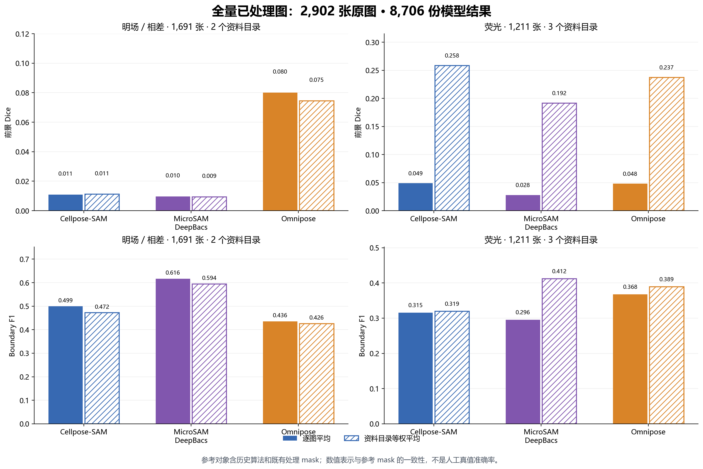
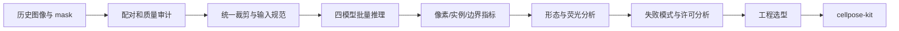

[English](README.md) | **简体中文**

# 细菌显微图像实例分割模型实测

> 从数据审计、定量对比到工程选型的细菌显微图像实例分割调研。

本仓库记录 Cellpose-SAM、MicroSAM DeepBacs、Omnipose 与传统图像处理流程在实验室细菌显微图像上的统一对比。项目先审计原图与 mask 的对应关系，再在同一坐标系和同一指标实现下评估模型输出，最终将工程结论落地为可部署的 [`cellpose-kit`](https://github.com/desperati0n/cellpose-kit)。

## 项目亮点

- 整理出 **2,902 对**可靠原图–参考 mask：明场/相差 1,691 对、荧光 1,211 对；另有 576 个处理文件因无法可靠配对而排除。
- 逐张审核 15 张人工/候选标注，只将 **11 张可靠荧光 GT** 用于定量准确率评估。
- 完成四个模型分支共 **8,706 份实例标签**：Cellpose-SAM 2,902、MicroSAM 2,902、Omnipose phase 1,691、Omnipose fluorescence 1,211。
- 统一比较 AP@0.50、AP@0.75、IoU、Dice、Boundary F1、计数误差、split/merge，以及匹配实例的形态与荧光误差。
- 公开 **45 张四模型对比画廊**，覆盖人工 GT、普通明场/荧光、密集场景和低对比失败场景。

## 核心结果

### 全量结果：2,902 张原图

下图使用已跑出的 8,706 条逐图模型结果，按明场/相差（1,691 张）和荧光（1,211 张）分别比较。实心柱按图像加权，斜线柱对资料目录等权平均。参考 mask 包含历史算法和既有处理结果，所以这些数值表示**一致性**，不等于人工真值准确率。[查看全量汇总数据](results/detailed/全量结果总览_按模态与权重.csv)。

可运行 `python scripts/build_full_results_chart.py` 从仓库内的逐图 CSV 重建图表（需要 pandas 和 matplotlib）。



### 人工真值准确率：11 张荧光图

以下结果来自 11 张通过质量审核的荧光人工 GT。样本量有限，因此用于工程选型与失败模式分析，不应解释为通用模型排行榜。

| 模型 | AP@0.50 ↑ | AP@0.75 ↑ | 前景 Dice ↑ | Boundary F1 ↑ | 中位相对计数误差 ↓ | split ↓ | merge ↓ |
|---|---:|---:|---:|---:|---:|---:|---:|
| Cellpose-SAM `cpsam_v2` | **0.3322** | 0.0183 | **0.6693** | 0.3496 | **0.0460** | 284 | 121 |
| MicroSAM DeepBacs | 0.3174 | **0.0655** | 0.5251 | **0.5512** | 0.1519 | **69** | **99** |
| Omnipose `bact_fluor` | 0.1892 | 0.0188 | 0.5989 | 0.4842 | 0.3663 | 82 | 278 |


## 对比结论

- **Cellpose-SAM** 是本批数据更强的覆盖/计数基线，但较多 split 会影响单菌测量。
- **MicroSAM DeepBacs** 的严格重叠、边界及匹配实例形态/荧光量更好，代价是部分密集图中的视觉覆盖不如 Cellpose 完整。
- **Omnipose** 提供按模态划分的细菌专用模型，但当前 `bact_fluor` 存在明显 merge 风险。
- 当前没有可靠明场人工 GT，因此明场结果只用于流程一致性和失败模式观察，不用于真实准确率排名。

## 对比画廊

完整画廊位于 [`figures/gallery/`](figures/gallery/)。每张 2×5 面板展示原图、四个模型的全景叠加和对应中心区域放大。


## 调研流程



## 仓库内容

```text
.
├── README.md / README.zh-CN.md
├── report/                         中英文完整技术报告
├── figures/
│   ├── metrics/                    汇总指标图
│   └── gallery/                    45 张四模型对比画廊
└── results/                        聚合及详细 CSV 结果
```

- [完整中文技术报告](report/technical-report.zh-CN.md)
- [Full technical report](report/technical-report.md)
- [画廊说明](figures/gallery/README.zh-CN.md)

## 公开范围

仓库包含调研报告、指标图、结果表和完整对比画廊，不分发约 31.8 GB 原始图片、9.3 GB 可视化增强图片、8.6 GB 全量处理中间结果、模型权重或虚拟环境。

历史 mask 只能衡量与旧流程的一致性，不能代替人工真值。最终模型选择仍应建立在具体任务指标和独立留出 GT 上。

## 从调研到部署

综合覆盖、计数表现、跨模态通用性、部署复杂度和许可证后，本调研选择 Cellpose-SAM 作为首个工程化基线。[`cellpose-kit`](https://github.com/desperati0n/cellpose-kit) 将其封装为 Docker/FastAPI GPU 服务与 Agent Skill，输出实例标签、质检预览、逐实例测量和可追溯运行元数据。

## 许可证说明

本仓库不包含模型权重。第三方代码、模型和权重分别适用各自许可证；版本相关的工程分析见[完整报告第 7 节](report/technical-report.zh-CN.md#7-许可证与商业使用分析)。为整个仓库选择许可证前，还需确认报告、图表和画廊图片的实际权属与公开权限。
