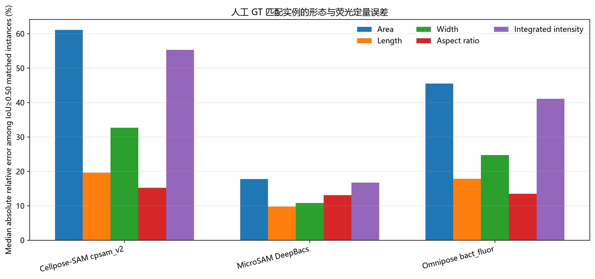
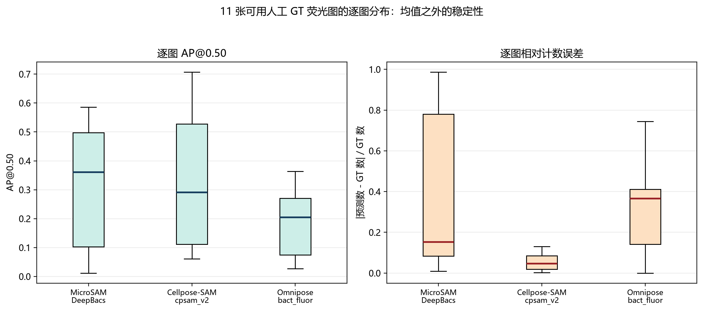
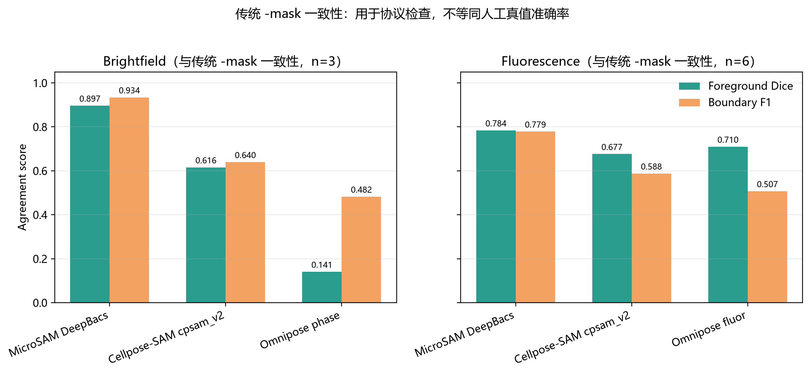
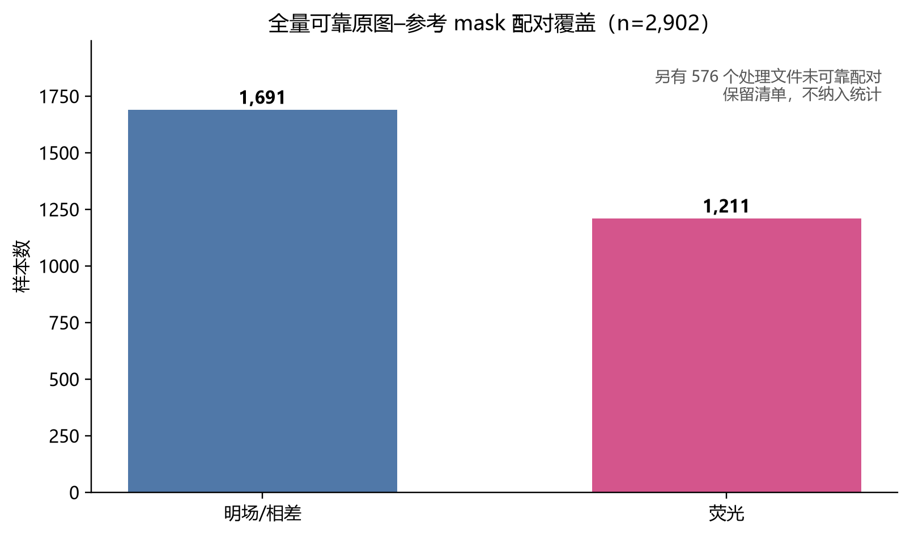
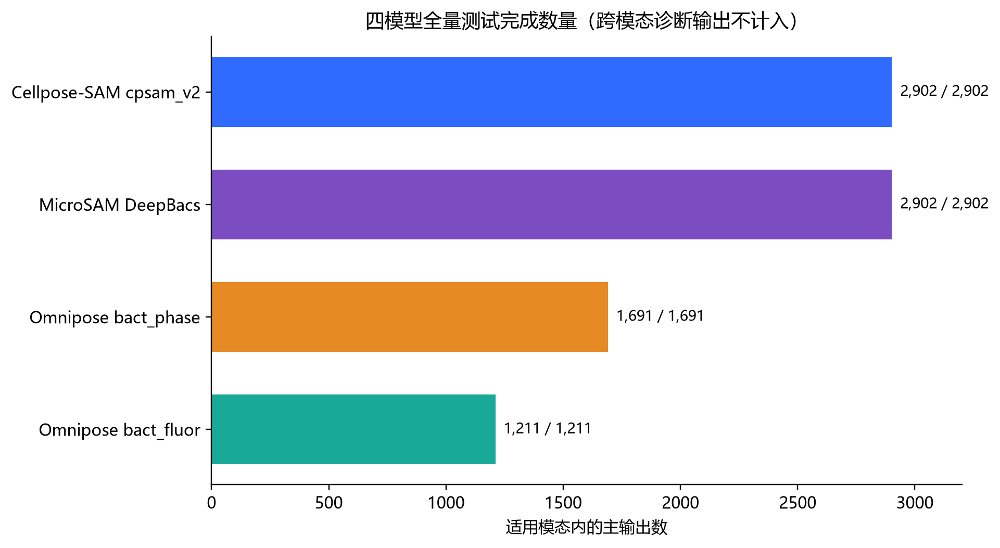
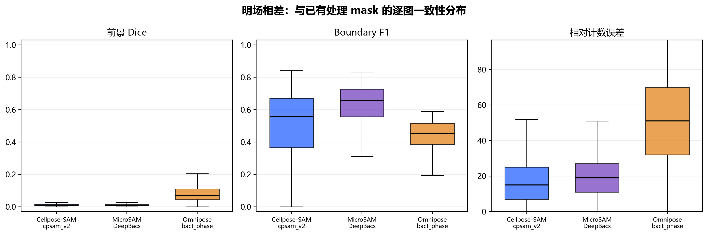
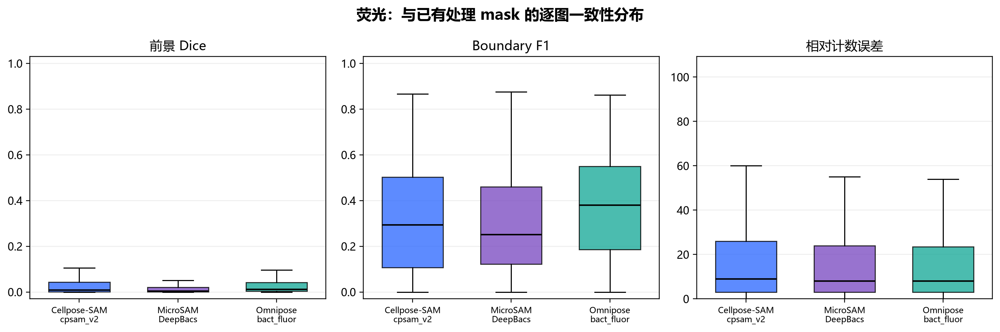
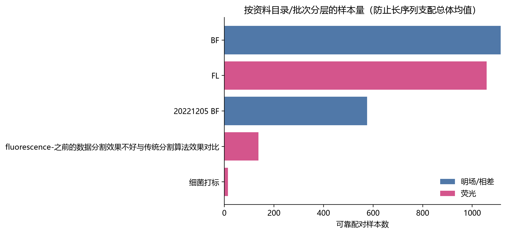
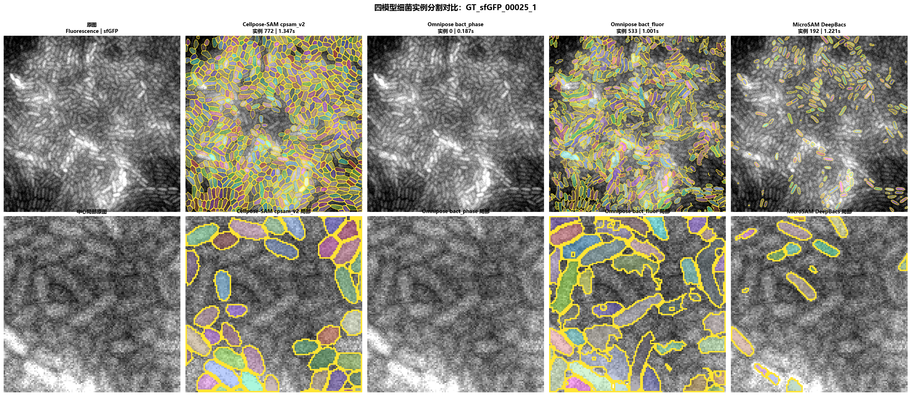
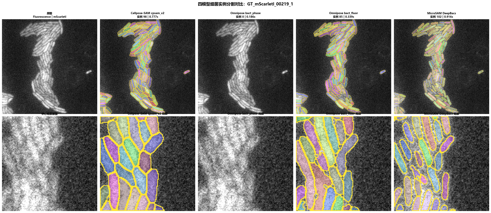

[**English**](technical-report.md) | [简体中文](technical-report.zh-CN.md)

# Technical Survey and Empirical Evaluation of Bacterial Microscopy Instance Segmentation

> **Public-repository edition:** This repository retains the complete four-model gallery, report figures, and metric CSV files. It does not distribute the full source-image collection, display-enhanced dataset, model weights, or batch prediction masks.

**Scope:** automatic instance segmentation, quantitative measurement, and human review for bacterial microscopy
**Study date:** 2026-08-20
**Hardware:** NVIDIA GeForce RTX 4060 Laptop GPU
**Data:** 2,902 reliable source-image/reference-mask pairs were identified: 1,691 brightfield/phase-contrast and 1,211 fluorescence. Another 576 processed files had no reliable source match and were excluded from primary statistics. Full-set labels were produced for Cellpose-SAM (2,902), MicroSAM DeepBacs (2,902), Omnipose `bact_phase` (1,691), and Omnipose `bact_fluor` (1,211). Of 15 manual or candidate annotations, 11 passed quality review and four require repair or further review.

## 1. Executive conclusions

The study did not assume one downstream task. It evaluated detection, instance separation, boundaries, morphology, fluorescence quantification, robustness, efficiency, and likely human-review cost rather than treating cell count as the only objective. GUIs are useful review interfaces, but controlled comparisons should use scripts or APIs with fixed preprocessing and parameters.

- On 11 usable fluorescence GT images, Cellpose-SAM `cpsam_v2` achieved the strongest mean **AP@0.50 (0.3322)**, foreground **Dice (0.6693)**, and median relative count error **(0.0460)**. It nevertheless produced 284 splits and weak AP@0.75/Boundary F1, showing that a near-correct count does not imply correct single-cell segmentation.
- MicroSAM DeepBacs led **AP@0.75 (0.0655)** and **Boundary F1 (0.5512)** and had the fewest split/merge errors. On IoU≥0.50 matched instances, it also had the lowest median area, length, width, and integrated-fluorescence errors. Its advantage is boundary and measurement fidelity—not total coverage.
- Omnipose provides separate phase/brightfield and fluorescence specialists. On this fluorescence GT set, `bact_fluor` reached Dice 0.5989 but produced 278 merges, making crowded-cell adhesion its main risk.
- Reliable brightfield human GT was unavailable. Brightfield results support consistency checks and failure discovery only, not a true accuracy ranking.
- Source code, weights, training data, and upstream dependencies require separate license review. Cellpose-SAM `cpsam_v2` and MicroSAM DeepBacs can be used commercially under their respective obligations. The evaluated Omnipose 1.1.4 route uses a University of Washington NonCommercial License and requires separate authorization for commercial deployment.

## 2. Technical routes

| Project | Official repository | Evaluated model/weights | Role |
|---|---|---|---|
| Cellpose / Cellpose-SAM | [MouseLand/cellpose](https://github.com/MouseLand/cellpose) | `cpsam_v2` | General baseline for cross-modality transfer and rapid full-image segmentation |
| Omnipose | [kevinjohncutler/omnipose](https://github.com/kevinjohncutler/omnipose) | `bact_phase_omnitorch_0`, `bact_fluor_omnitorch_0` | Bacteria-specific brightfield/phase and fluorescence baselines |
| microSAM | [computational-cell-analytics/micro-sam](https://github.com/computational-cell-analytics/micro-sam) | DeepBacs specialist: `vit_l.pt` + `vit_l_decoder.pt` | Automatic segmentation and interactive correction candidate |

### 2.1 Selection rationale

**Cellpose-SAM** tests whether a general model provides a sufficiently strong starting point without local bacterial fine-tuning. **Omnipose** targets elongated, curved, branched, or crowded bacteria and separates acquisition modalities through specialist weights. **MicroSAM DeepBacs** combines microscopy-specialist weights with an interactive correction path suitable for model-first, human-review workflows.

## 3. Evaluation against human ground truth

### 3.1 Protocol and metric definitions

The manual-mask inventory contained 15 entries. Eleven passed spatial alignment, foreground morphology, and rendering review. One mask was spatially misaligned and three contained rendering artifacts or abnormal colors. Those four were not treated as correct answers. See the [audit detail](../results/detailed/人工掩码覆盖审计.csv) and [summary](../results/manual_gt_audit_summary.csv).

Batch inference used a shared 512×512 window. Larger images were center-cropped, and the identical crop was applied to GT/reference masks. Images already at 512×512 were unchanged. Predictions and references therefore remained in one coordinate system. Instance metrics used one-to-one matching at fixed IoU thresholds.

- **AP@0.50 / AP@0.75:** `TP / (TP + FP + FN)` after one-to-one matching at the corresponding IoU threshold.
- **Foreground IoU / Dice:** overlap after collapsing all instances into binary foreground; these metrics cannot determine whether touching bacteria remain separate.
- **Boundary F1:** boundary precision/recall harmonic mean within the configured tolerance.
- **Median relative count error:** median per-image `|prediction count − GT count| / GT count`.
- **Split / merge:** one GT represented by multiple predictions / multiple GT instances represented by one prediction.

**Core quality metrics (higher is better):**

| Model | n | AP@0.50 | AP@0.75 | Foreground IoU | Foreground Dice | Boundary F1 |
|---|---:|---:|---:|---:|---:|---:|
| Cellpose-SAM `cpsam_v2` | 11 | **0.3322** | 0.0183 | **0.5099** | **0.6693** | 0.3496 |
| MicroSAM DeepBacs AIS | 11 | 0.3174 | **0.0655** | 0.4063 | 0.5251 | **0.5512** |
| Omnipose `bact_fluor` | 11 | 0.1892 | 0.0188 | 0.4501 | 0.5989 | 0.4842 |

**Error structure (lower is better):**

| Model | Median relative count error | Splits | Merges |
|---|---:|---:|---:|
| Cellpose-SAM `cpsam_v2` | **0.0460** | 284 | 121 |
| MicroSAM DeepBacs AIS | 0.1519 | **69** | **99** |
| Omnipose `bact_fluor` | 0.3663 | 82 | 278 |

The phase-specific `bact_phase_omnitorch_0` should not be ranked on these fluorescence GT images.

### 3.2 Visual completeness and measurement fidelity

The gallery indicates that **Cellpose-SAM is the strongest visual-coverage and counting baseline in this batch**, particularly for crowded fluorescence images. MicroSAM should not be described as the overall winner. Its strength lies on another evaluation axis: strict overlap and single-instance fidelity.

There is no independent human table of per-cell length, width, orientation, and fluorescence. The measurements below are therefore derived by mapping model/GT instance regions back onto source fluorescence images. Predicted and GT instances were matched one-to-one at IoU≥0.50; values are medians over matched instances.

| Model | Matched instances* | Match IoU | Area error | Length error | Width error | Aspect-ratio error | Mean-intensity error | Integrated-intensity error | Orientation error |
|---|---:|---:|---:|---:|---:|---:|---:|---:|---:|
| Cellpose-SAM `cpsam_v2` | 1,197 | 0.585 | 61.1% | 19.6% | 32.7% | 15.3% | 3.2% | 55.3% | **3.7°** |
| MicroSAM DeepBacs | 838 | **0.678** | **17.8%** | **9.8%** | **10.8%** | **13.1%** | **1.3%** | **16.8%** | 4.0° |
| Omnipose `bact_fluor` | 595 | 0.604 | 45.5% | 17.8% | 24.7% | 13.5% | 2.9% | 41.1% | **3.7°** |

\*Matched-instance count depends on recall, splitting, and the match threshold and is not an independent accuracy score. Matched-only statistics have selection bias.

Cellpose-SAM gives stronger total coverage/counting but larger matched-instance area and integrated-intensity errors, consistent with its high split count. DeepBacs matches fewer instances but better preserves the geometry and fluorescence of each matched bacterium. The outcome is a task division: **Cellpose for coverage/counting; MicroSAM for boundary/single-cell measurement**.

### 3.3 Per-image variation and structural failures

Means hide variation caused by channel, density, and image quality. A production study should also report per-image distributions, medians, interquartile ranges, and bootstrap confidence intervals, stratified by modality, channel, density, SNR, cell size, and acquisition batch.

### 3.4 Agreement with historical masks

No human brightfield GT was available, only masks from a previous workflow. The following values measure similarity to that workflow and must not be presented as true accuracy.

| Modality | References | Model | Foreground Dice | Boundary F1 |
|---|---:|---|---:|---:|
| Brightfield | 3 | MicroSAM DeepBacs AIS | **0.8966** | **0.9344** |
| Brightfield | 3 | Cellpose-SAM `cpsam_v2` | 0.6159 | 0.6397 |
| Brightfield | 3 | Omnipose `bact_phase` | 0.1408 | 0.4825 |
| Fluorescence | 6 | MicroSAM DeepBacs AIS | **0.7841** | **0.7786** |
| Fluorescence | 6 | Cellpose-SAM `cpsam_v2` | 0.6766 | 0.5877 |
| Fluorescence | 6 | Omnipose `bact_fluor` | 0.7097 | 0.5074 |

### 3.5 Full extension set

The audit paired 2,902 source images with existing processed results: 1,691 brightfield/phase-contrast and 1,211 fluorescence. Only records traceable through filename, dimensions, and path rules were included; 576 unresolved processed files were excluded.

Because these references mix manual, conventional, and historical processing sources, the table represents **agreement with existing processed masks**, not human-GT accuracy. It must not be merged with the 11-image ranking.

Omnipose was routed by modality: `bact_phase_omnitorch_0` was evaluated only on the 1,691 brightfield/phase images and `bact_fluor_omnitorch_0` only on the 1,211 fluorescence images. Cellpose-SAM and MicroSAM covered all 2,902 images. Three early cross-modality Omnipose diagnostics were excluded through the manifest modality field.

| Modality | References | Model | Foreground Dice | Boundary F1 | Median relative count error | Splits | Merges |
|---|---:|---|---:|---:|---:|---:|---:|
| Brightfield/phase | 1,691 | Cellpose-SAM `cpsam_v2` | 0.0109 | 0.4992 | 15.0 | 0 | 0 |
| Brightfield/phase | 1,691 | MicroSAM DeepBacs | 0.0097 | **0.6164** | 19.0 | 0 | 0 |
| Brightfield/phase | 1,691 | Omnipose `bact_phase` | **0.0801** | 0.4357 | 51.0 | 1 | 0 |
| Fluorescence | 1,211 | Cellpose-SAM `cpsam_v2` | **0.0488** | 0.3155 | 9.0 | 339 | 145 |
| Fluorescence | 1,211 | MicroSAM DeepBacs | 0.0277 | 0.2955 | **8.0** | **90** | **116** |
| Fluorescence | 1,211 | Omnipose `bact_fluor` | 0.0480 | **0.3675** | **8.0** | 187 | 315 |

Reference source, rendering, batch, and sequence length affect these averages. Directory-equal-weighted fluorescence Dice was 0.2583 for Cellpose, 0.1915 for MicroSAM, and 0.2371 for `bact_fluor`, reinforcing the need to interpret global means alongside strata.

The overview below uses all 8,706 per-image model results from 2,902 source images. Solid bars average over images; hatched bars average source directories equally after calculating each directory mean. These are agreement scores against existing processed masks, not human-GT accuracy. The plotted values are in [`results/detailed/全量结果总览_按模态与权重.csv`](../results/detailed/全量结果总览_按模态与权重.csv).

Per-image details, overall summaries, source-stratified summaries, and the read-error inventory are available under [`results/detailed/`](../results/detailed/). The read-error inventory is empty; historical BMP/JPEG content was included through an image-decoding fallback.

## 4. Comprehensive evaluation framework

When no single downstream task is fixed, a robust study should consider the following dimensions.

| Dimension | Recommended measures | Acquisition method | Current status |
|---|---|---|---|
| Pixel coverage | IoU, Dice, pixel precision/recall, specificity, MCC | Collapse instances to foreground and compare with aligned GT | IoU/Dice available on 11 fluorescence GT images |
| Instance detection | AP@0.50:0.95, instance precision/recall/F1, misses/false positives | One-to-one matching on an IoU matrix | AP50/AP75 implemented |
| Combined instance quality | PQ, SQ, RQ, AJI/AJI+ | Combine recognition and contour quality | Can be derived from existing labels |
| Boundary quality | Boundary F1, ASSD, Hausdorff 95%, contour offset | Extract contours and compute bidirectional distances | Boundary F1 available |
| Split/merge | split, merge, overlap graph | Analyze instance overlap rather than total count | Implemented |
| Topology | clDice, skeleton overlap, endpoints, branches, Euler number | Skeletonize rod-shaped or curved bacteria | Future extension |
| Morphology | area, perimeter, length, width, aspect ratio, eccentricity, orientation, circularity, solidity | Region properties per integer label | Core measurements evaluated |
| Fluorescence | background-corrected intensity, integrated signal, CV, channel ratio, axial profile | Index original 16-bit values with labels | Mean/integrated error evaluated |
| Population structure | density, nearest neighbors, orientation agreement, clustering | Centroids and adjacency graphs | Computable but segmentation-dependent |
| Robustness | stratified metrics and perturbation curves | Stratify by modality/batch/SNR; add controlled noise, blur, and intensity changes | Exploratory only |
| Uncertainty/OOD | entropy, ensemble disagreement, TTA variance | Preserve probability maps or run ensembles | Only cross-model disagreement currently available |
| Compute cost | latency, throughput, peak VRAM/RAM, startup, CPU fallback | Warmed repeated runs with resource logging | RTX 4060 feasibility shown |
| Human-review cost | correction time, interactions, acceptance rate | Log GUI/napari correction events | Not yet recorded |
| Annotation reliability | inter-annotator Dice/AP and disagreement | Independent double annotation and adjudication | No independent double annotation yet |
| Temporal biology | growth, division, lineage, IDF1/HOTA | Segment and associate time-lapse frames | Current data is static |

### Recommended artifacts

Each evaluated image should retain: the original image and acquisition metadata; an integer instance-label TIFF; model/weight/software/parameter/crop/runtime metadata; per-image metrics; a per-instance match and measurement table; and a human-correction log where applicable.

The recommended computation flow is:

`source image + metadata → aligned GT/model labels → quality control → one-to-one matching → pixel/instance/boundary/topology metrics → morphology/intensity mapping → stratification → confidence intervals → failure gallery + traceable CSV`

Final ranking must use an independent held-out GT set. Images used for threshold tuning cannot also be the final test set. Historical masks cannot replace human ground truth.

## 5. Representative outcomes and failure modes

### Dense sfGFP with human GT

This scene exposes over-segmentation, misses, and crowding. Visual richness does not guarantee instance correctness.

### mScarletI with human GT

This scene checks short-rod boundaries, adjacent-cell separation, and fluorescence preservation in another channel.

### Dense and low-contrast brightfield scenes

These images have no human GT and are included only for failure discovery and annotation planning.

## 6. Deployment configuration and execution

### 6.1 Study environment

| Component | Configuration |
|---|---|
| GPU | RTX 4060 Laptop; PyTorch CUDA available |
| Input | Shared 512×512 windows; center crop for larger images and identical crop for references |
| Cellpose | Cellpose 4.2.1.1; `cpsam_v2` |
| Omnipose | Omnipose 1.1.4; phase/fluorescence weights; Qt-compatible launcher |
| microSAM | micro-sam 1.8.9; ViT-L + AIS decoder |
| Evaluation | Duplicate samples, pairing errors, crops, and foreground polarity corrected before separating human-GT accuracy from historical-mask agreement |

### 6.2 Official references

| Component | Model documentation | Operation documentation |
|---|---|---|
| Cellpose-SAM | [Cellpose models](https://cellpose.readthedocs.io/en/latest/models.html) | [Cellpose GUI](https://cellpose.readthedocs.io/en/latest/gui.html) |
| Omnipose | [Models and input parameters](https://omnipose.readthedocs.io/models.html) | [Omnipose documentation](https://omnipose.readthedocs.io/) |
| MicroSAM DeepBacs | [microSAM models and API](https://computational-cell-analytics.github.io/micro-sam/micro_sam.html) | [2D annotator](https://computational-cell-analytics.github.io/micro-sam/micro_sam/sam_annotator/annotator_2d.html) |
| napari + microSAM | [microSAM quickstart](https://computational-cell-analytics.github.io/micro-sam/) | [Image-series annotator](https://computational-cell-analytics.github.io/micro-sam/micro_sam/sam_annotator/image_series_annotator.html) |

### 6.3 Recommended execution strategy

- **Batch research and formal evaluation:** scripts/APIs with fixed models, preprocessing, and parameters; export integer labels, probability maps, per-image logs, and runtime.
- **Single-image review and correction:** Cellpose/Omnipose GUI or microSAM + napari for parameter inspection, difficult-instance correction, and GT creation.
- **Selection by task:** for brightfield/phase images, prioritize testing `bact_phase` and DeepBacs; for fluorescence, compare `bact_fluor`, DeepBacs, and `cpsam_v2`. In this study, Cellpose is the coverage/count baseline, MicroSAM the boundary/measurement candidate, and Omnipose fluorescence requires close merge monitoring.

The engineering outcome is [`cellpose-kit`](https://github.com/desperati0n/cellpose-kit), which packages Cellpose-SAM as a Dockerized FastAPI GPU service and an Agent Skill.

## 7. Licensing and commercial use

This section reflects the versions and model sources reviewed on 2026-08-21. Code, pretrained weights, training data, and upstream dependencies are separate licensing layers. This is an engineering review, not legal advice.

| Evaluated model | Code/framework | Weight/upstream license | Commercial-use assessment | Main obligations and risks |
|---|---|---|---|---|
| Cellpose-SAM `cpsam_v2` | Cellpose: BSD-3-Clause | Official weight repository: BSD-3-Clause; upstream SAM: Apache-2.0 | **Permitted** | Preserve notices, avoid implied endorsement, and retain source/version records |
| Omnipose `bact_phase_omnitorch_0` | Tested Omnipose 1.1.4: NonCommercial | Historical weight route; no separate authorization obtained | **Not directly permitted in this tested configuration** | Contact UW CoMotion; a newer MIT branch does not automatically relicense old artifacts |
| Omnipose `bact_fluor_omnitorch_0` | Same as above | Same as above | **Not directly permitted in this tested configuration** | Obtain authorization or migrate to clearly licensed weights and revalidate |
| MicroSAM DeepBacs Specialist | microSAM: MIT; SAM: Apache-2.0 | DeepBacs specialist weights: CC BY 4.0 | **Permitted** | Preserve notices and attribute the weights, source, and modifications |

### 7.1 Cellpose-SAM

Cellpose source code uses BSD-3-Clause, and the official Cellpose-SAM model repository also identifies BSD-3-Clause. A note that training data contains CC-BY-NC material should not automatically be rewritten as a noncommercial declaration for the published `cpsam_v2` weights. The weight license and the licenses governing reuse of training images are separate. Any redistribution or retraining with source datasets still requires dataset-level review.

### 7.2 Omnipose 1.1.4

The tested environment used Omnipose 1.1.4, whose license is the Omnipose NonCommercial License and directs commercial users to University of Washington CoMotion. A later MIT license on the current branch does not by itself prove retroactive relicensing of 1.1.4 or its historical weights. Commercial deployment should obtain written authorization, validate a clearly licensed newer model/weight combination, or use an alternative.

### 7.3 MicroSAM DeepBacs

microSAM uses MIT, upstream Segment Anything uses Apache-2.0, and the evaluated DeepBacs specialist record on Zenodo is CC BY 4.0. Commercial integration is possible while retaining applicable notices and providing the model authors, model name, Zenodo DOI `10.5281/zenodo.11115827`, CC BY 4.0 link, and a modification statement.

### 7.4 Recommended commercial-delivery record

Maintain a Third-Party Software / Model Notices document containing:

1. Exact software versions, weight filenames, sources, checksums, and acquisition dates.
2. Cellpose BSD-3-Clause, Cellpose-SAM weight-license, and Segment Anything Apache-2.0 notices.
3. microSAM MIT, Segment Anything Apache-2.0, and DeepBacs CC BY 4.0 attribution.
4. Omnipose 1.1.4 NonCommercial terms plus written authorization or an explicit exclusion from distribution.
5. A distinction between server-only execution, bundled weights, user-triggered downloads, and newly trained weight distribution.
6. Legal review before product release, including weights, datasets, dependencies, trademarks, attribution, and research/medical-use disclaimers.

## References

- [Cellpose repository](https://github.com/MouseLand/cellpose)
- [Cellpose BSD-3-Clause license](https://github.com/MouseLand/cellpose/blob/main/LICENSE) and [official Cellpose-SAM model repository](https://huggingface.co/mouseland/cellpose-sam)
- [Recorded Cellpose-SAM licensing discussion](https://kemal.yaylali.uk/cellseg-v0-1-0-is-out/)
- [Omnipose repository](https://github.com/kevinjohncutler/omnipose) and [paper](https://www.nature.com/articles/s41592-022-01639-4)
- [Omnipose v1.1.4 NonCommercial License](https://github.com/kevinjohncutler/omnipose/blob/v1.1.4/LICENSE) and [current MIT license](https://github.com/kevinjohncutler/omnipose/blob/main/LICENSE)
- [microSAM repository](https://github.com/computational-cell-analytics/micro-sam) and [paper](https://www.nature.com/articles/s41592-024-02580-4)
- [microSAM MIT license](https://github.com/computational-cell-analytics/micro-sam/blob/main/LICENSE) and [DeepBacs specialist weights](https://zenodo.org/records/11115827)
- [Panoptic Quality](https://arxiv.org/abs/1801.00868)
- [clDice](https://arxiv.org/abs/2003.07311)
